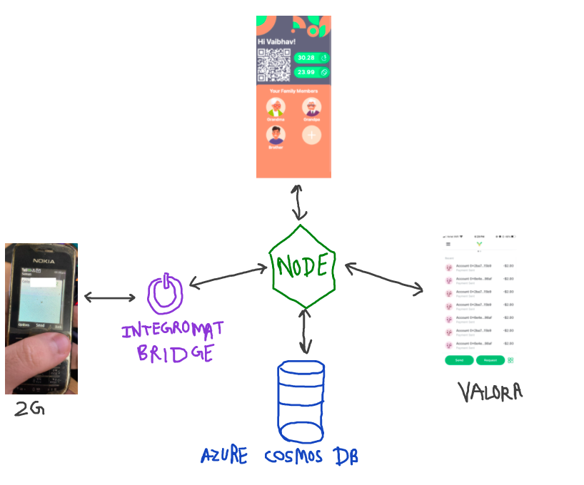
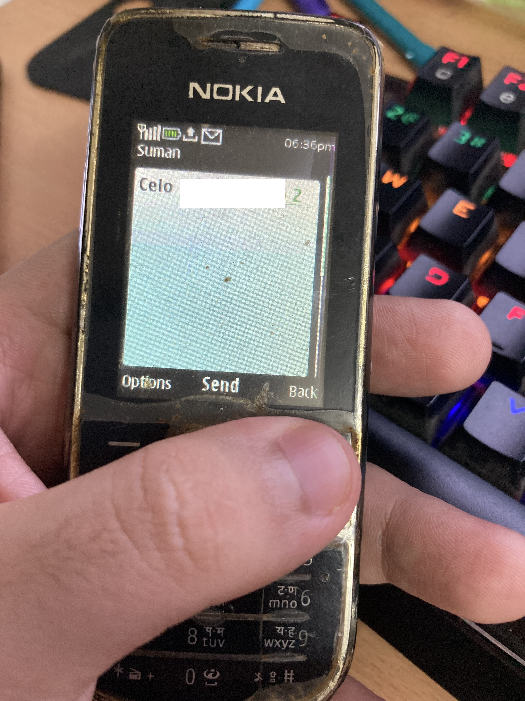

## Easy Celo Payments for 2G Phones

### 🤔 Why Build for Feature Phones?

- Still very popular in low income places like Sub-Saharan Africa, where even the cheapest Android devices are prohibitively expensive for many.
- Resurgence in the last few years by efforts from Reliance (JioPhone) and KaiOS (Mozilla Foundation fork).
- I had a couple of them still lying around in my house.

### 💡 The Idea

- Let's say I am an active Celo user and have the Valora wallet installed.
- My grandmother also wants to make payments to local shopkeepers who accept Celo but she doesn't have a smartphone with her at all times.
- Using this service, she will be able to make payments using my Celo account without having the wallet herself.
- But that's not all, I can also monitor her activity and set limits to see she doesn't splurge away all the money, on ice-cream or something. Monitoring is important as well.

### 🏗️ Architectural Design Made With a Sharpie

### Some Screenshots

.png>)

_(1).png>)

_(2).png>)

Integromat Scenario that acts as a bridge from 2G to HTTP

### 🤕 Known Pitfalls and Issues

- Maybe storing private key on 2G phone would be safer, think JAR files.
- No way to have monthly recurring budgets yet.
- Relies on Cosmos DB for now, at least I couldn't think of a safe or easy was to use Smart contracts in this use case.
- Kind of discourages more numbers actually joining and getting attestations.
- This version involves storing private key on ONE CENTRALISED server for quick approvals on message receipt, which is not always ideal, unless you are the only person who owns that server. This brings me to the future scope:

### 😃 How We Can Actually Make It Better and More Usable

- Instead of just keeping the private key on server, maybe the family member should just send a message to me.
- I can develop an app that listens to messages and decides if that family member is eligible (is under max limit for the month, etc).
- If everything sounds fine, I should get a PUSH NOTIFICATION which would prompt me to sign the transaction so that payment can be made.
- It's just like asking your parents for OTPs when you try doing a transaction from their credit/debit cards.
- So I will sign the transactions each time and make the payment on their behalf.

### 👨🏻‍💻 Tech Stack

- PWA/TWA Made Using React
- Typescript Backend
- Azure Cosmos DB
- Integromat for Listening to Messages and forward them to the server
- Tailwind for styling

### 😁 Check it out

[https://github.com/sudo-vaibhav/celo2g](https://github.com/sudo-vaibhav/celo2g)
